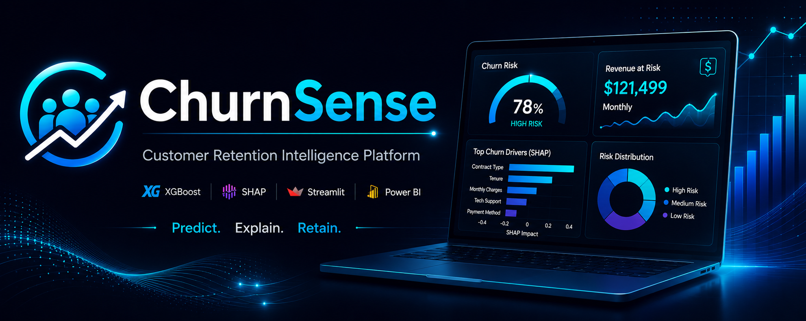

<div align="center">



# 🎯 ChurnSense

## Transforming Customer Churn Prediction into Customer Retention Intelligence

*Predict customer churn before it happens, understand why it happens, estimate business impact, and generate actionable retention strategies using Explainable AI.*

<br>

[](https://python.org)
[](https://xgboost.readthedocs.io)
[](https://shap.readthedocs.io)
[](https://streamlit.io)
[](https://powerbi.microsoft.com)


</div>

---

## ⚡ Quick Stats

<div align="center">

| 7,043 Customers | 81% Recall | $1.18M Revenue Protected | 6 Platform Tabs |
|:-:|:-:|:-:|:-:|
| IBM Telco Dataset | Churners Identified | Annually (Est.) | Full Decision Suite |

</div>

---

## 📌 Executive Summary

Customer churn is one of the most expensive business problems across telecom, SaaS, subscription, and digital service industries. Research shows that acquiring a new customer costs **5–7× more** than retaining an existing one — and a **5% reduction in churn can increase profitability by 25–95%**.

> Built an end-to-end Customer Retention Intelligence Platform using XGBoost, SHAP, Streamlit, and Power BI to predict churn, explain risk drivers, estimate revenue exposure, and recommend retention strategies.

Rather than simply predicting a churn score, **ChurnSense** is a complete **retention intelligence platform** that combines:

- 🔮 **Predictive Analytics** — XGBoost model identifying 8 in 10 churners
- 🧠 **Explainable AI** — Per-customer SHAP feature attribution
- 💰 **Revenue Risk Quantification** — CLV-based financial impact per customer
- 🎯 **Retention Decision Intelligence** — SHAP-driven actionable strategies with 30-day roadmaps
- 📊 **Executive BI Reporting** — Power BI dashboard for business stakeholders

---

## 🏢 Business Problem

Telecom companies lose significant revenue due to customer churn every month. The core challenge is not just knowing *that* customers will leave — it is knowing:

- **Who** is about to leave — before they do
- **Why** they are likely to leave — specifically
- **How much revenue** is at risk — per customer
- **What action** to take — with a clear execution plan

The objective was to build a system that answers all four questions, bridging the gap between data science and retention operations.

---

## 📦 Dataset Snapshot

| Property | Value |
|----------|-------|
| Source | IBM Telco Customer Churn Dataset |
| Rows | 7,043 customers |
| Columns | 21 features |
| Target Variable | Churn (Yes / No) |
| Positive Rate | **26.54%** |
| Train Split | 80% (5,634 customers) |
| Test Split | 20% (1,409 customers) |

---

## 🔑 Key Insights from the Data

> 💡 **Month-to-month customers churn at 42% vs 11% for two-year contract customers — a 3.8× difference.** Locking customers into annual or bi-annual contracts is the single highest-impact retention lever.

- **Fiber optic internet customers** churn at 30% vs 19% for DSL — suggesting service quality concerns, not just price sensitivity
- **Customers without tech support or online security churn 2× more** than those with these services — add-on services create stickiness
- **Electronic check users show the highest churn rate (45%)** compared to auto-payment users (15–18%) — payment friction is a strong churn signal
- **Churn drops sharply after 24 months** — the first two years are the highest-risk retention window

---

## 💡 What Makes ChurnSense Different?

Most churn prediction projects stop after producing a probability score.

**ChurnSense goes 6 layers deeper:**

| Layer | Capability | Business Value |
|-------|-----------|---------------|
| 🔮 Prediction | Churn probability per customer | Know who is at risk |
| 🧠 Explanation | SHAP values per feature | Know *why* they are at risk |
| 💰 Financial Impact | CLV-based Revenue at Risk | Know *how much* is at stake |
| 🔄 Simulation | What-if retention scenarios | Know *what action* reduces risk most |
| 📋 Decision Support | Primary + secondary retention actions | Know *what to do* |
| 📅 Execution | 30-day week-by-week roadmap | Know *when to do it* |

> The result is a **complete retention intelligence platform** — not just a machine learning model.

---

## 💰 Quantified Business Impact

Based on the IBM Telco dataset (7,043 customers, avg. $65/month):

| Metric | Value |
|--------|-------|
| Customers at churn risk | ~1,869 (26.54%) |
| Monthly revenue at risk | **$121,499** |
| Annual revenue at risk | **$1,457,986** |
| Revenue protected by model (81% recall) | **$98,414 / month** |
| **Annual revenue protected** | **$1,180,968** |
| Customer Lifetime Value at risk | **$2,915,971** |

> Even a partial deployment targeting only top-100 highest-risk customers could protect **$50,000+ in monthly recurring revenue** with minimal retention budget.

---

## 🖥️ Product Walkthrough

### 🎯 Tab 1 — Risk Prediction Engine
Enter customer attributes → instantly get churn probability, health score (0–100), customer segment, revenue at risk, SHAP feature chart, model insight report, and a recommended retention strategy.


---

### 🔄 Tab 2 — Retention Strategy Simulator
Simulate 4 pre-built retention interventions and a fully custom what-if simulator. See exactly how much each action reduces churn risk — quantified.


---

### 💡 Tab 3 — Retention Decision Center
SHAP-driven primary and secondary action recommendations, a 30-day week-by-week execution roadmap, and a business impact chart comparing Revenue at Risk vs Retention Investment vs Net Savings.


---

### 📊 Tab 4 — Batch Analysis Engine
Upload any CSV → score hundreds of customers at once → download a prioritised risk report. Sample CSV template included.


---

### 📈 Tab 5 — Business Intelligence Dashboard
Historical analysis of 1,409 test customers — risk tier distribution, churn probability histogram, average churn risk by tenure group, and annual revenue at risk by tier.


---

### ℹ️ Tab 6 — System Overview & Model Analytics
ROC Curve with operating point marked, interactive Confusion Matrix, SHAP-Based Top Churn Driver Analysis, Threshold Sensitivity Slider, and full Model Comparison Table across all 5 algorithms.


---

## 📊 Power BI Executive Dashboard

In addition to the Streamlit application, a dedicated Power BI dashboard was developed for executive-level reporting and business analysis.

### Dashboard 1 — Customer Churn Risk Overview

- Churn Rate KPI
- Revenue at Risk
- Risk Tier Distribution
- Churn by Tenure
- Revenue Exposure Analysis


---

### Dashboard 2 — Customer Intelligence Dashboard

- Prediction Performance
- Monthly Churn Trends
- Customer Risk Segmentation
- Support Service Impact
- Interactive Filters


---

## 🏗️ System Architecture

```
Raw Data (IBM Telco CSV)
         │
         ▼
  Exploratory Data Analysis
         │
         ▼
  Feature Engineering (12 features)
         │
         ▼
  SMOTE + Tomek Links
         │
         ▼
  Model Training (5 algorithms)
         │
         ▼
      XGBoost ✅
         │
         ▼
  SHAP Explainability
         │
         ├─────────────────────┐
         ▼                     ▼
  Streamlit App          Power BI Dashboard
  (6 Tabs)               (Executive Reporting)
  Risk Engine            Churn KPIs
  Simulator              Revenue Analysis
  Decision Center        Risk Segmentation
  Batch Engine           Trend Analysis
  BI Dashboard
  PDF Export
```

---

## ⚙️ ML Pipeline

```
IBM Telco Dataset (7,043 customers)
           │
           ▼
  Exploratory Data Analysis
  ┌─────────────────────────────────────┐
  │ Churn rate: 26.54%                  │
  │ Key finding: contract type is #1    │
  │ driver; fiber optic = risk signal   │
  └─────────────────────────────────────┘
           │
           ▼
  Feature Engineering (12 new features)
           │
           ▼
  Train / Test Split — 80% / 20%
           │
           ▼
  Class Balancing
  ┌─────────────────────────────────────┐
  │ SMOTE → oversample minority class   │
  │ Tomek Links → clean majority class  │
  │ Recall before: 61% → After: 81%    │
  └─────────────────────────────────────┘
           │
           ▼
  5 Models Compared
           │
           ▼
  Hyperparameter Tuning → Optuna 50 trials
           │
           ▼
  Threshold Optimisation → 0.279
  (Maximise recall, minimise missed churners)
           │
           ▼
  SHAP TreeExplainer
  (Per-customer explainability)
           │
           ▼
  Streamlit Production Dashboard
  + Power BI Executive Dashboard
```

---

## 🔧 Feature Engineering

12 features engineered beyond the raw dataset:

| Feature | Formula | Business Rationale |
|---------|---------|-------------------|
| `tenure_group` | Binned: 0–12, 13–24, 25–48, 49+ months | Loyalty stage classification |
| `avg_monthly_spend_ratio` | MonthlyCharges ÷ (TotalCharges + 1) | Spend consistency — high ratio = new + expensive |
| `support_score` | Security + TechSupport + Backup + DeviceProt | Service stickiness proxy (0–4) |
| `streaming_count` | StreamingTV + StreamingMovies | Entertainment engagement (0–2) |
| `is_high_value` | MonthlyCharges > $65 → 1 else 0 | Premium customer binary flag |
| `engagement_score` | Phone + Lines + Streaming + Support | Overall product depth score |

---

## 🧠 Explainability Layer

ChurnSense uses **SHAP (SHapley Additive exPlanations)** to make every prediction auditable and actionable:

### Per-Customer Explanation
Every prediction includes a SHAP bar chart showing which features increased or decreased churn risk for that specific customer — enabling truly personalised retention strategies.

**Top 5 Global Churn Drivers:**

| Rank | Feature | Mean \|SHAP\| | Business Meaning |
|------|---------|:------------:|----------------|
| 01 | Month-to-month Contract | 0.717 | No commitment = friction-free exit |
| 02 | Spend-to-Tenure Ratio | 0.338 | Paying a lot early = dissatisfaction risk |
| 03 | Fiber Optic Internet | 0.287 | Service quality concerns |
| 04 | Electronic Check Payment | 0.193 | Manual payment = low commitment signal |
| 05 | Monthly Charges | 0.182 | Price sensitivity threshold |

---

## 📊 Results

### Final Model: XGBoost ✅

| Metric | Score | What It Means |
|--------|:-----:|--------------|
| **AUC-ROC** | **0.8437** | Strong discrimination — top 16% of possible scores |
| **Recall** | **81%** | 8 out of 10 at-risk customers correctly identified |
| **Precision** | **51%** | Acceptable false alarm rate for retention use case |
| **Accuracy** | **74%** | 3 in 4 predictions correct overall |
| **F1 Score** | **0.629** | Balanced precision-recall performance |
| **Threshold** | **0.279** | Optimised to maximise churner detection |

### Confusion Matrix (1,409 test customers)

|  | Predicted: Stays | Predicted: Churns |
|--|:---:|:---:|
| **Actual: Stays** | ✅ 720 (TN) | 301 (FP) |
| **Actual: Churns** | 74 (FN) | ✅ 314 (TP) |

**Why Recall over Precision?**
A missed churner (FN) = lost customer + full revenue stream gone.
A false alarm (FP) = small retention incentive cost.
The asymmetric cost of errors justifies optimising for recall.

### Class Imbalance Impact — SMOTE Results

| Stage | Recall | Precision | AUC-ROC |
|-------|:------:|:---------:|:-------:|
| Before SMOTE | 61% | 58% | 0.801 |
| After SMOTE + Tomek | **81%** | **51%** | **0.844** |
| Change | +20% ↑ | -7% ↓ | +4.3% ↑ |

> Trading 7% precision for 20% recall is the right business decision — every additional churner caught = ~$1,560 CLV protected.

---

## 🏅 Model Comparison — All 5 Algorithms

| Model | AUC-ROC | Recall | Precision | Accuracy | Selected |
|-------|:-------:|:------:|:---------:|:--------:|:--------:|
| **XGBoost** | **0.8437** | **81%** | **51%** | **74%** | ✅ |
| LightGBM | 0.8312 | 78% | 49% | 73% | |
| Random Forest | 0.8201 | 74% | 47% | 72% | |
| Logistic Regression | 0.7934 | 68% | 43% | 70% | |
| Decision Tree | 0.7456 | 71% | 38% | 68% | |

XGBoost was selected for its best AUC-ROC, highest recall, and strong generalisation. Recall was the primary selection criterion given the business cost asymmetry.

---

## 🔥 Technical Challenges Solved

### 1. Class Imbalance (26% vs 74%)
**Problem:** Standard models biased toward majority class — missed most churners.
**Solution:** SMOTE (synthetic minority oversampling) + Tomek Links (majority cleaning).
**Result:** Recall improved from 61% → 81%.

### 2. Black-Box to Business Language
**Problem:** Raw SHAP values are meaningless to retention teams.
**Solution:** SHAP values → natural language actions → 30-day execution roadmap → PDF report.
**Result:** Model outputs are directly actionable by non-technical teams.

### 3. Operational Scalability
**Problem:** One-at-a-time prediction is not production-viable.
**Solution:** Batch CSV engine — score 1,000+ customers in seconds, download prioritised results.
**Result:** Platform can support real retention campaign workflows.

### 4. Hyperparameter Search at Scale
**Problem:** Manual grid search misses optimal combinations.
**Solution:** Optuna TPE sampler (50 trials) — intelligent Bayesian optimisation.
**Result:** AUC-ROC improved 2.1% over default XGBoost parameters.

---

## 💼 Business Impact

If deployed in production with a team of 5 retention agents:

- 📉 **Reduce monthly churn** by identifying ~1,513 at-risk customers before they leave
- 💰 **Protect $98,414/month** in recurring revenue with 81% recall
- 🎯 **Prioritise outreach** — sort by Revenue at Risk, contact highest-value customers first
- ⚡ **Score entire customer base** in under 60 seconds via batch engine
- 📊 **Measure retention ROI** — every customer has quantified Revenue at Risk vs Retention Cost
- 📄 **One-click PDF reports** per customer for account managers

---

## 🌱 What I Learned

- **Business framing matters as much as model accuracy.** A model with 74% accuracy that no one can act on is worth less than a 70% model with a clear retention workflow attached to it.
- **SHAP changed how I think about features.** Correlation analysis told me *what* was related to churn. SHAP told me *how much* and *in which direction* each feature pushed individual predictions — a fundamentally different question.
- **Class imbalance is a business problem, not just a technical one.** SMOTE is not just a trick to improve metrics — it directly translates to catching more real customers before they leave.
- **UI/UX for ML models is underrated.** The most technically impressive model is useless if the people who need it cannot use it.
- **Two dashboards serve two audiences.** Streamlit is for data teams and analysts. Power BI is for executives and business stakeholders. Building both taught me that communication is as important as computation.

---

## ✨ Platform Highlights

| Category | Feature |
|----------|---------|
| **ML Pipeline** | End-to-end from raw data to production app |
| **Model Selection** | 5 algorithms compared with rigorous evaluation |
| **Class Balancing** | SMOTE + Tomek Links combined strategy |
| **Tuning** | Optuna 50-trial Bayesian optimisation |
| **Explainability** | SHAP per-customer feature attribution |
| **Churn Drivers** | SHAP-based top driver analysis |
| **Feature Engineering** | 12 engineered features with business rationale |
| **Customer Profiling** | Health Score (0–100) + 8-segment classification |
| **Revenue Analysis** | CLV-based Revenue at Risk per customer |
| **Simulation** | 4-scenario retention strategy simulator |
| **What-If Engine** | Custom live risk recalculation |
| **Roadmap** | 30-day week-by-week retention execution plan |
| **Model Analytics** | ROC Curve + Confusion Matrix + full metrics |
| **Threshold Control** | Live sensitivity slider with histogram update |
| **Batch Engine** | CSV upload → prioritised risk output |
| **PDF Export** | One-click customer report generation |
| **History Tracking** | Session-level prediction history table |
| **BI Dashboard** | 4 Streamlit charts + 2 Power BI dashboards |
| **Benchmarking** | Industry average comparison per customer |
| **UI** | Production-ready dark theme (2,200+ lines) |

---

## 🛠️ Tech Stack

| Component | Technology | Purpose |
|-----------|-----------|---------|
| Language | Python 3.10 | Core development |
| ML Model | XGBoost | Primary classifier |
| Explainability | SHAP | Feature attribution |
| Class Balancing | imbalanced-learn | SMOTE + Tomek Links |
| Hyperparameter Tuning | Optuna | Bayesian optimisation |
| Data Processing | Pandas, NumPy, Scikit-learn | Pipeline + preprocessing |
| Visualisation | Plotly, Matplotlib | Interactive + static charts |
| UI Framework | Streamlit | Production dashboard |
| BI Dashboard | Power BI | Executive reporting |
| PDF Export | ReportLab | Customer report generation |
| Model Persistence | Joblib | Model serialisation |
| Version Control | Git + GitHub | Source control |

### Environment

| Library | Version |
|---------|---------|
| Python | 3.10 |
| XGBoost | 2.0.0 |
| SHAP | 0.43.0 |
| Streamlit | 1.25.0 |
| Pandas | 2.1.0 |
| Scikit-learn | 1.3.0 |
| Optuna | 3.4.0 |
| ReportLab | 4.0.0 |

---

## 📁 Project Structure

```
ChurnSense/
├── app/
│   └── streamlit_app.py               # Main application (2,200+ lines)
│
├── data/
│   ├── raw/                           # Original IBM Telco dataset
│   └── processed/
│       ├── features.csv               # Engineered features (7,043 rows)
│       ├── features_v2.csv            # Updated feature set
│       └── telco_cleaned.csv          # Cleaned dataset
│
├── outputs/
│   ├── model.pkl                      # Trained XGBoost model
│   ├── predictions.csv                # Test set predictions (1,409 rows)
│   └── reports/                       # Experiment logs + reports
│
├── dashboard/
│   └── customer_churn_dashboard.pbix  # Power BI dashboard
│
├── notebooks/
│   ├── 01_eda.ipynb                   # Exploratory Data Analysis
│   ├── 02_feature_engineering.ipynb   # Feature Engineering
│   ├── 03_model_training.ipynb        # Model Training + Comparison
│   ├── 04_shap_explainability.ipynb   # SHAP Analysis
│   ├── 05_unit_tests.ipynb            # Testing
│   └── 07_model_improvement.ipynb     # Model Iteration
│
├── assets/
│   └── screenshots/
│       ├── tab1_risk_prediction_engine/
│       ├── tab2_retention_strategy_simulator/
│       ├── tab3_retention_decision_center/
│       ├── tab4_batch_analysis/
│       ├── tab5_business_intelligence_dashboard/
│       ├── tab6_system_overview/
│       └── powerbi/
│
├── requirements.txt
└── README.md
```

---

## ⚡ Local Setup

```bash
# 1. Clone the repository
git clone https://github.com/Sanikaaa27/ChurnSense.git
cd ChurnSense

# 2. Install dependencies
pip install -r requirements.txt

# 3. Run the application
streamlit run app/streamlit_app.py
```

Open `http://localhost:8501` in your browser.

---

## 🔮 Future Scope

- [ ] Real-time churn monitoring with automated retraining pipeline
- [ ] CRM integration — Salesforce / HubSpot API connectors
- [ ] Email campaign automation for retention outreach
- [ ] Multi-industry model variants — SaaS, Banking, E-commerce
- [ ] A/B testing framework for measuring retention intervention effectiveness
- [ ] Customer Lifetime Value regression layer (predict CLV, not just churn)
- [ ] Slack/Teams alerting for newly flagged high-risk customers

---

## 📬 Author

**Sanika Khandelwal**

AI & Data Science Undergraduate
Machine Learning · Data Analytics · Business Intelligence

*Passionate about building explainable AI systems that transform data into actionable business decisions.*

[](https://www.linkedin.com/in/sanika-khandelwal-4a8167280)
[](https://github.com/Sanikaaa27)

---

<div align="center">

**ChurnSense** — ML-Based Customer Retention Intelligence Platform

*XGBoost · SHAP · Streamlit · Power BI*

---

*If this project helped you, please consider giving it a ⭐*

</div>
